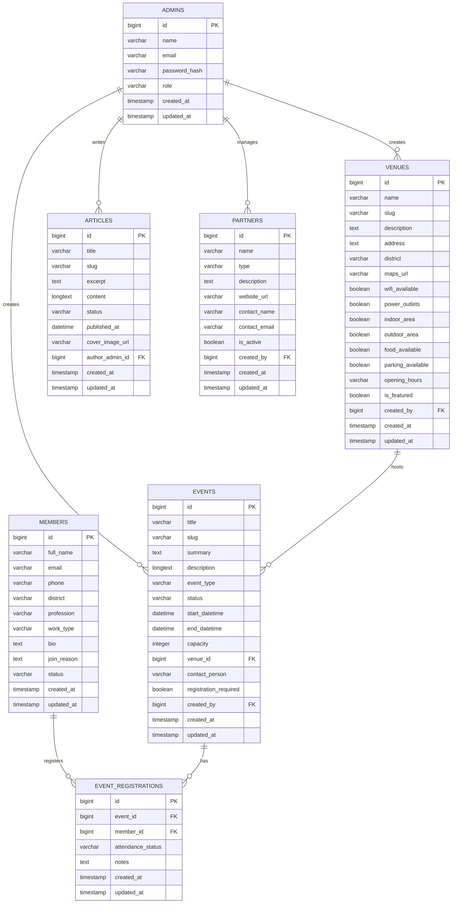

# ERD Website Probolinggo Remote Club

## Tujuan Dokumen

Dokumen ini menjelaskan rancangan awal struktur data untuk website Probolinggo Remote Club. ERD ini disusun untuk mendukung kebutuhan MVP komunitas, khususnya untuk pengelolaan anggota, event, venue, artikel, dan admin.

## Ruang Lingkup Data MVP

ERD awal ini mencakup entitas:

1. `admins`
2. `members`
3. `events`
4. `event_registrations`
5. `venues`
6. `articles`
7. `partners` opsional

## Asumsi Dasar

1. Satu admin dapat membuat banyak event, artikel, dan venue.
2. Satu member dapat mendaftar ke banyak event.
3. Satu event dapat memiliki banyak pendaftar.
4. Venue dapat dipakai oleh banyak event.
5. Partner bersifat opsional untuk kerja sama venue, komunitas, atau sponsor non-komersial.

## Entitas dan Atribut

### 1. `admins`

Menyimpan data pengelola website.

| Field | Type | Keterangan |
| --- | --- | --- |
| id | bigint | Primary key |
| name | varchar | Nama admin |
| email | varchar | Email unik admin |
| password_hash | varchar | Password terenkripsi |
| role | varchar | Role admin, misalnya super_admin atau editor |
| created_at | timestamp | Waktu dibuat |
| updated_at | timestamp | Waktu diperbarui |

### 2. `members`

Menyimpan data anggota komunitas.

| Field | Type | Keterangan |
| --- | --- | --- |
| id | bigint | Primary key |
| full_name | varchar | Nama lengkap |
| email | varchar | Email unik anggota |
| phone | varchar | Nomor WhatsApp atau telepon, opsional |
| district | varchar | Kecamatan atau domisili |
| profession | varchar | Profesi atau pekerjaan |
| work_type | varchar | remote, hybrid, atau aspirant |
| bio | text | Deskripsi singkat, opsional |
| join_reason | text | Alasan bergabung, opsional |
| status | varchar | pending, approved, rejected, active |
| created_at | timestamp | Waktu dibuat |
| updated_at | timestamp | Waktu diperbarui |

### 3. `venues`

Menyimpan data tempat yang cocok untuk kerja remote atau meetup.

| Field | Type | Keterangan |
| --- | --- | --- |
| id | bigint | Primary key |
| name | varchar | Nama venue |
| slug | varchar | Slug unik |
| description | text | Deskripsi venue |
| address | text | Alamat lengkap |
| district | varchar | Kecamatan atau area |
| maps_url | varchar | Tautan peta, opsional |
| wifi_available | boolean | Ada Wi-Fi atau tidak |
| power_outlets | boolean | Ada colokan atau tidak |
| indoor_area | boolean | Ada area indoor atau tidak |
| outdoor_area | boolean | Ada area outdoor atau tidak |
| food_available | boolean | Ada makanan atau tidak |
| parking_available | boolean | Ada parkir atau tidak |
| opening_hours | varchar | Jam operasional, opsional |
| is_featured | boolean | Ditampilkan sebagai rekomendasi utama |
| created_by | bigint | FK ke admins.id |
| created_at | timestamp | Waktu dibuat |
| updated_at | timestamp | Waktu diperbarui |

### 4. `events`

Menyimpan data kegiatan komunitas.

| Field | Type | Keterangan |
| --- | --- | --- |
| id | bigint | Primary key |
| title | varchar | Judul event |
| slug | varchar | Slug unik |
| summary | text | Ringkasan event |
| description | longtext | Deskripsi lengkap |
| event_type | varchar | meetup, coworking, sharing_session, dll |
| status | varchar | draft, published, completed, cancelled |
| start_datetime | datetime | Waktu mulai |
| end_datetime | datetime | Waktu selesai |
| capacity | integer | Kapasitas peserta, opsional |
| venue_id | bigint | FK ke venues.id, opsional |
| contact_person | varchar | PIC event, opsional |
| registration_required | boolean | Perlu RSVP atau tidak |
| created_by | bigint | FK ke admins.id |
| created_at | timestamp | Waktu dibuat |
| updated_at | timestamp | Waktu diperbarui |

### 5. `event_registrations`

Menyimpan data pendaftaran anggota ke event.

| Field | Type | Keterangan |
| --- | --- | --- |
| id | bigint | Primary key |
| event_id | bigint | FK ke events.id |
| member_id | bigint | FK ke members.id |
| attendance_status | varchar | registered, attended, cancelled, waitlist |
| notes | text | Catatan tambahan, opsional |
| created_at | timestamp | Waktu dibuat |
| updated_at | timestamp | Waktu diperbarui |

### 6. `articles`

Menyimpan artikel, update, dan pengumuman komunitas.

| Field | Type | Keterangan |
| --- | --- | --- |
| id | bigint | Primary key |
| title | varchar | Judul artikel |
| slug | varchar | Slug unik |
| excerpt | text | Ringkasan singkat |
| content | longtext | Isi artikel |
| status | varchar | draft atau published |
| published_at | datetime | Tanggal publikasi, opsional |
| cover_image_url | varchar | URL gambar cover, opsional |
| author_admin_id | bigint | FK ke admins.id |
| created_at | timestamp | Waktu dibuat |
| updated_at | timestamp | Waktu diperbarui |

### 7. `partners`

Entitas opsional untuk kolaborasi komunitas, venue partner, atau pihak pendukung.

| Field | Type | Keterangan |
| --- | --- | --- |
| id | bigint | Primary key |
| name | varchar | Nama partner |
| type | varchar | venue, community, sponsor, media, dll |
| description | text | Deskripsi singkat |
| website_url | varchar | Website partner, opsional |
| contact_name | varchar | Nama kontak, opsional |
| contact_email | varchar | Email kontak, opsional |
| is_active | boolean | Status aktif |
| created_by | bigint | FK ke admins.id |
| created_at | timestamp | Waktu dibuat |
| updated_at | timestamp | Waktu diperbarui |

## Relasi Antar Entitas

1. Satu `admin` dapat membuat banyak `venues`.
2. Satu `admin` dapat membuat banyak `events`.
3. Satu `admin` dapat menulis banyak `articles`.
4. Satu `admin` dapat menambahkan banyak `partners`.
5. Satu `venue` dapat digunakan oleh banyak `events`.
6. Satu `member` dapat memiliki banyak `event_registrations`.
7. Satu `event` dapat memiliki banyak `event_registrations`.

## Diagram ERD Mermaid

## Catatan Implementasi

1. `members.email`, `admins.email`, dan seluruh `slug` sebaiknya unik.
2. `event_registrations` sebaiknya memiliki unique constraint gabungan pada `event_id` dan `member_id` agar satu anggota tidak mendaftar event yang sama lebih dari satu kali.
3. Field seperti `status`, `event_type`, dan `work_type` dapat menggunakan enum atau string tervalidasi sesuai stack yang dipilih.
4. Jika nanti komunitas ingin menampilkan profil anggota publik, tabel `members` dapat ditambah field seperti `profile_photo_url`, `linkedin_url`, atau `is_public`.
5. Jika nanti dibutuhkan galeri dokumentasi, dapat ditambahkan tabel `media_galleries` dan `media_items`.

## Rekomendasi Tahap Lanjut

Setelah ERD awal ini, langkah teknis berikutnya yang disarankan adalah:

1. Menentukan stack backend dan database.
2. Menurunkan ERD menjadi schema migration.
3. Menentukan field mana yang wajib dan opsional pada MVP.
4. Menyusun API contract atau backend specification.
5. Menyelaraskan ERD dengan desain UI dan flow admin.
